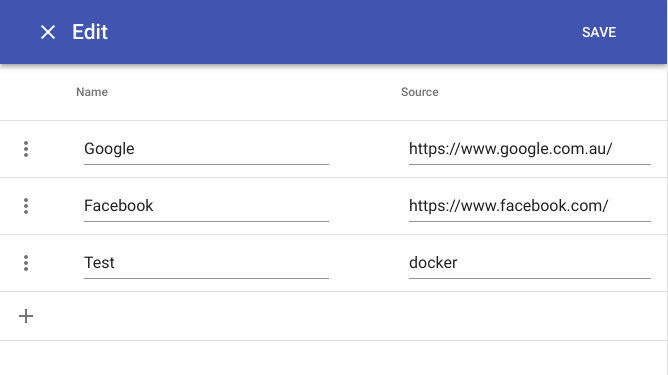
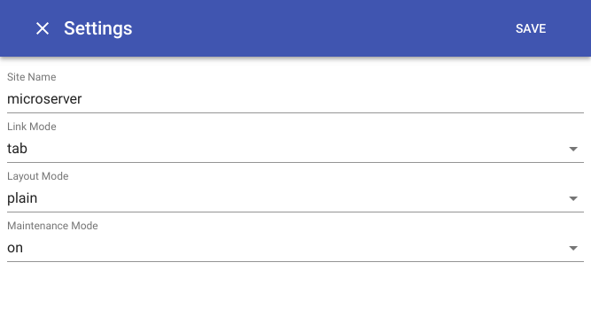

# alandr (awesome-lander)

<table>
  <tr>
    <td></td>
    <td></td>
    <td></td>
  </tr>
</table>

alandr is a landing page app that oragnizes all your self hosted services in a simple, clean and efficient manner.

## Docker Setup (recommended)

```
$ docker create --name=alandr -v /data/alandr:/data -p 80:80 benletchford/alandr
```

## Build Instructions

The recommended way to use this app is via docker. However, if you need to build it yourself here's some instructions.

### Manual Build

Build the frontend app.
```
$ cd alandr/www
$ yarn build
```

Setup the `bottle` server.
```
$ cd alandr/server
$ pip install -r requirements.txt
```

### Docker Build

Build and run the docker image.
```
$ docker build -t alandr .
$ docker run -it --rm -v /data:/data -p 80:80 --name alandr alandr
```
